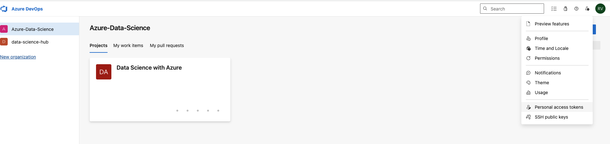
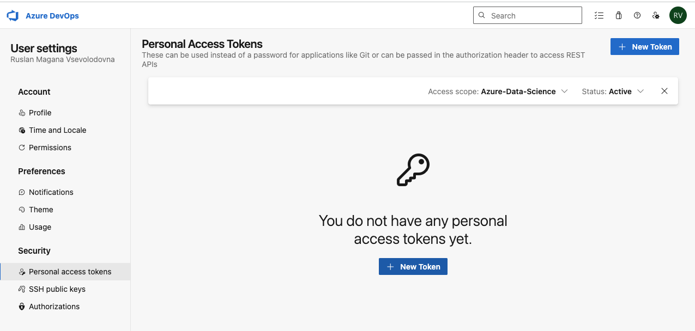
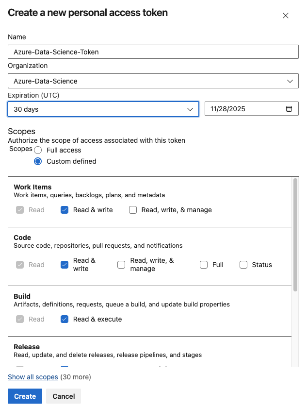
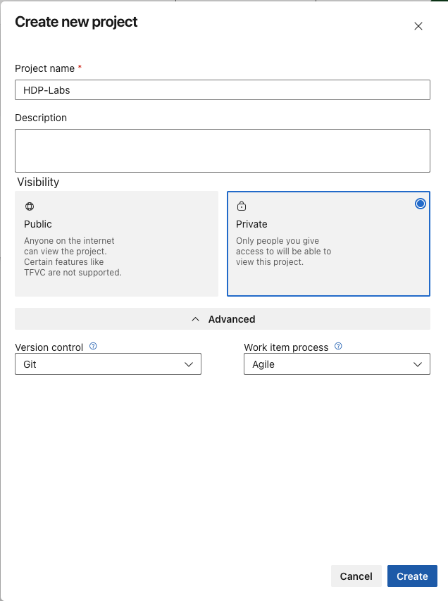
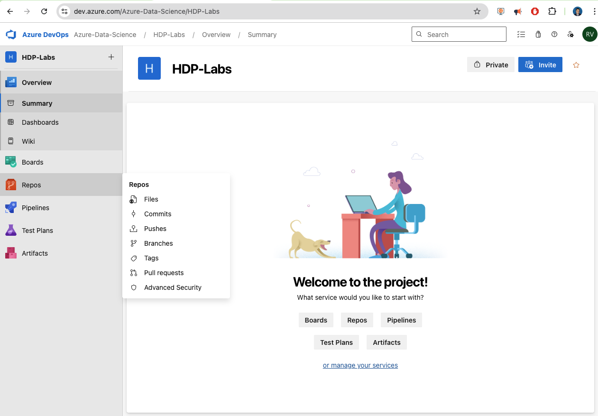
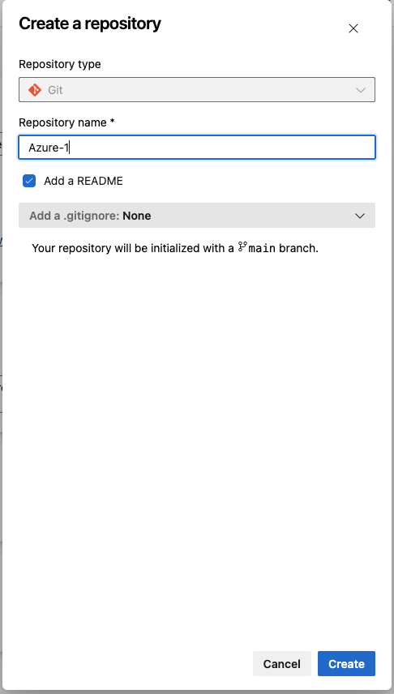
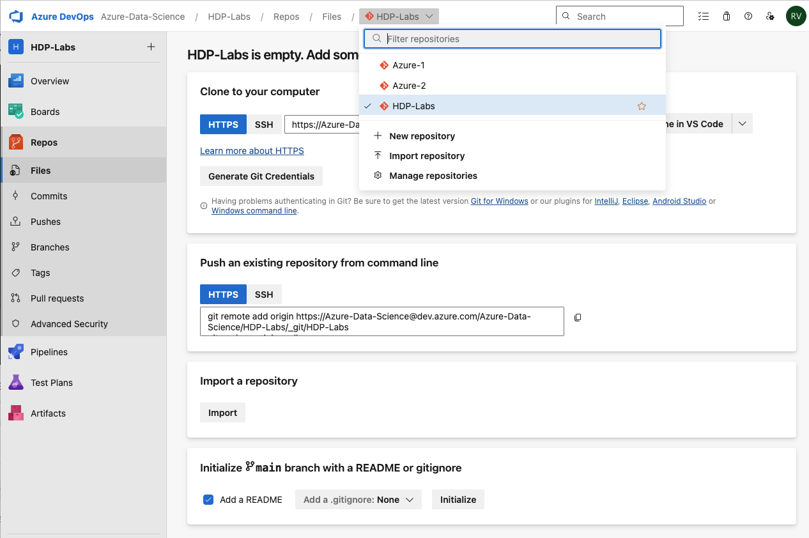
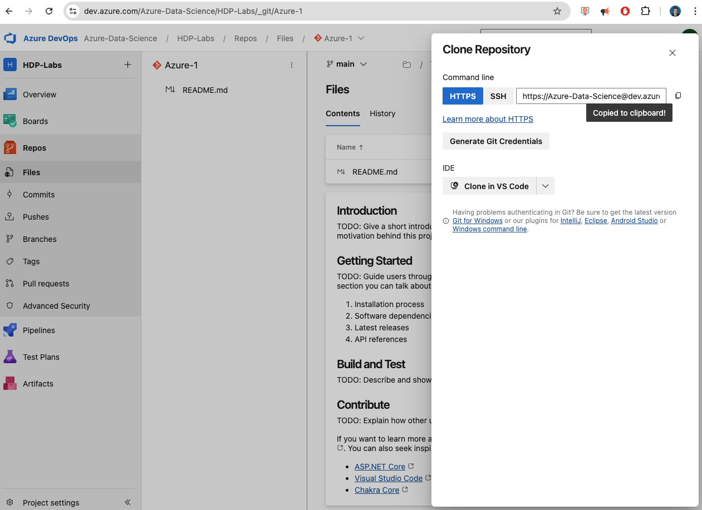

# Azure-DevOps-Tutorial

*A complete, hands-on tutorial with ready-to-run code and scripts.*

[](#)
[](#)
[](#)
[](LICENSE)

---

## ✨ What is this?

This repository is a **complete, hands-on lab** to master **Microsoft Azure DevOps**:

- 🐳 A one-container **DevOps Box** that runs an Azure Pipelines **self-hosted agent** **and** **SSHD** under `supervisord`.
- ✂️ Scripts to split a monorepo (**HDP**) into **Azure-1** (Folder1 + Folder2) and **Azure-2** (Folder3), **preserving full Git history**.
- ⚙️ Sample **YAML pipelines** with **path filters**, **secure defaults**, and options for **hosted** or **self-hosted** pools.

```bash
git clone https://github.com/ruslanmv/Azure-Devops-Tutorial
cd Azure-Devops-Tutorial
````

---

## ⚡ Quick start

> Prereqs: Docker (recommended), Git, and a shell (Bash or PowerShell 7+).

```bash
make env                      # creates .env from template (first time)
# Edit .env and set AZP_URL, AZP_TOKEN, AZP_POOL, AZP_AGENT_NAME (see below)
make up                       # start the DevOps Box (agent + SSH)
make docs-serve               # docs at http://127.0.0.1:8000
make ssh                      # ssh devops@localhost -p 2222 (password from .env)
```

> 💡 Tip: `make help` lists all available targets.

---

## 🔐 Get your `AZP_TOKEN` (Personal Access Token)

1. Go to **[https://dev.azure.com](https://dev.azure.com)** → sign in.
2. Click your **avatar → Personal access tokens → New Token**.
3. Set:

   * **Name**: `devops-box` (any label)
   * **Organization**: the same org as your `AZP_URL`
   * **Expiration**: choose a reasonable lifetime
   * **Scopes**: ✅ **Agent Pools (Read & manage)** *(required for the agent)*
4. **Create** and **copy** the token (you will only see it once).
5. Open `.env` and set:

```ini
AZP_URL=https://dev.azure.com/<your-org>
AZP_TOKEN=<PASTE_YOUR_TOKEN>
AZP_POOL=Default
AZP_AGENT_NAME=docker-agent-1
AZP_WORK_DIR=_work
# Optional (recommended): enable key-based SSH
# SSH_PUBLIC_KEY=ssh-ed25519 AAAA... user@host
```

> 🔒 Keep your PAT **secret**. Do **not** commit `.env`.

---

## 🧩 Components at a glance

* **Docker image**: Azure Pipelines agent + OpenSSH + `supervisord`
* **`.env`**: configuration for agent registration & SSH
* **`/scripts`**: monorepo split helpers (history-preserving)
* **`/pipelines`**: sample YAML pipelines with path filters
* **`/docs`**: MkDocs site for guidance and API notes

---

## 🏗️ What you’ll build

* 🧰 A one-container **DevOps Box** (self-hosted agent + SSH, managed by *supervisord*).
* 🪵 Two Azure Repos created from one source repo (**HDP**) with three folders:

  * `Azure-1` ⟵ **Folder1 + Folder2**
  * `Azure-2` ⟵ **Folder3**
* 🧪 Two pipelines with **path filters**, reusable templates, and secure defaults.
* 🔐 Professional **branch policies** and **security** guardrails.

```
HDP (monorepo)
├─ Folder1  ──┐
├─ Folder2  ──┴─► Azure-1 (history preserved)
└─ Folder3  ─────► Azure-2 (history preserved)
```

---

## 🔧 Configuration (edit `.env`)

| Variable         | Example                                | Description                                    |
| ---------------- | -------------------------------------- | ---------------------------------------------- |
| `AZP_URL`        | `https://dev.azure.com/your-org`       | Your Azure DevOps **organization** URL         |
| `AZP_TOKEN`      | `azdopat_********`                     | PAT with scope **Agent Pools (Read & manage)** |
| `AZP_POOL`       | `Default`                              | Agent pool name                                |
| `AZP_AGENT_NAME` | `devops-box-01`                        | Display name of the agent                      |
| `AZP_WORK_DIR`   | `_work`                                | Agent working directory inside the container   |
| `SSH_PUBLIC_KEY` | `ssh-ed25519 AAAA... user@host` (opt.) | Enable key-based SSH into the container        |
| `SSH_PASSWORD`   | `changeMe123` (dev only)               | Password for `devops@localhost -p 2222`        |

> 🔒 **Security note**: Use the smallest scope needed, rotate tokens, and never commit secrets.

---

## 🚀 Useful Make targets

```bash
make env          # create .env from template
make build        # build the Docker image
make up           # start container in background
make down         # stop & remove container
make restart      # restart the container
make logs         # tail logs (Ctrl+C to exit)
make ps           # show running containers
make ssh          # SSH into the container (devops@localhost -p 2222)
make docs-serve   # serve local docs (MkDocs)
make clean        # stop & remove container & volumes
```

---

## 🌐 See the agent **online** in Azure DevOps

1. Open **[https://dev.azure.com](https://dev.azure.com)** → your **Organization** → your **Project**.
2. **Project settings** (bottom-left) → **Agent pools**.
3. Open your pool (e.g., `Default`) and verify agent **`AZP_AGENT_NAME`** is **Online**.

> If it’s **Offline**, double-check `.env` (especially `AZP_TOKEN` and `AZP_URL`) and run `make down && make up`, then `make logs`.

---

## 🧭 Access the container

**SSH (recommended):**

```bash
make ssh
# == ssh devops@localhost -p 2222
```

**Docker exec (no SSH):**

```bash
docker compose exec azdo-agent bash
# or:
docker exec -it azdo-agent bash
```

> ℹ️ `AZP_*` env vars are injected into the container’s **startup** process; your SSH shell won’t print them with `printenv`. That’s expected.

---

## 🧪 Optional: quick pipeline smoke test

Create `.azure-pipelines/selfhosted-smoke.yml`:

```yaml
trigger: none
pool:
  name: Default        # or your pool
steps:
- script: |
    echo "Hello from $(Agent.Name) on $(Agent.MachineName)"
    uname -a || ver
  displayName: "Self-hosted agent smoke"
```

In Azure DevOps: **Pipelines → New pipeline → Existing Azure Pipelines YAML file** → select this file → **Run**.

---

## 🆘 Troubleshooting

* **Agent not registering**: ensure `AZP_TOKEN` is a real PAT with **Agent Pools (Read & manage)**, then `make down && make up`.
* **SSH refused**: `make ps` should show `0.0.0.0:2222->22/tcp`; if not, `make restart`.
* **Host key changed**: `ssh-keygen -R [localhost]:2222`.
* **Supervisor checks (host side)**:

  ```bash
  docker compose exec -u root azdo-agent supervisorctl status
  docker compose exec -u root azdo-agent tail -n 200 /var/log/supervisor/supervisord.log
  ```


## 📚 Table of Contents

1. [Introduction](#introduction)
2. [What is Azure DevOps?](#what-is-azure-devops)
3. [Prerequisites](#prerequisites)
4. [Setting Up Your Azure DevOps Organization](#setting-up-your-azure-devops-organization)
5. [Understanding Personal Access Tokens (PATs)](#understanding-personal-access-tokens-pats)
6. [Creating Your First Project](#creating-your-first-project)
7. [Building the DevOps Box: Your Local CI/CD Environment](#building-the-devops-box)
8. [Understanding Self-Hosted Agents](#understanding-self-hosted-agents)
9. [The Repository Split Challenge](#the-repository-split-challenge)
10. [Creating Azure Pipelines](#creating-azure-pipelines)
11. [Branch Policies and Security](#branch-policies-and-security)
12. [Best Practices](#best-practices)
13. [Troubleshooting Guide](#troubleshooting-guide)
14. [Conclusion](#conclusion)

---

## Introduction

Welcome to the most comprehensive Azure DevOps tutorial you'll find! This isn't just another checklist of Azure DevOps features. Instead, we're going to build something real and practical: a complete CI/CD environment that runs on your local machine.

**What makes this tutorial different?**

- **Hands-on from start to finish**: Every command is explained and ready to run
- **Real-world scenarios**: We'll solve actual problems like splitting monolithic repositories
- **Production-ready setup**: Everything we build follows industry best practices
- **Fully local**: No need for cloud resources to get started
- **Complete code**: All scripts, configurations, and pipelines included

By the end of this tutorial, you'll have:

1. A working Azure DevOps organization
2. A "DevOps Box" - a Docker container that acts as your build server
3. Multiple repositories with automated pipelines
4. Professional branch protection and security policies
5. Deep understanding of how Azure DevOps works under the hood

Let's dive in!

---

## What is Azure DevOps?

Azure DevOps is Microsoft's comprehensive DevOps platform that provides everything you need to plan, develop, test, and deploy software. Think of it as your complete software factory in the cloud.

### Core Components

**Azure Repos**: Git repositories with advanced features like branch policies, pull request workflows, and code reviews. It's like GitHub, but integrated into the Azure ecosystem.

**Azure Pipelines**: Your CI/CD automation engine. It can build, test, and deploy your code to any platform - Windows, Linux, macOS, containers, or cloud services.

**Azure Boards**: Agile project management tools with Kanban boards, backlogs, and sprint planning. Perfect for tracking work items and user stories.

**Azure Test Plans**: Comprehensive testing tools for manual and exploratory testing.

**Azure Artifacts**: Package management for Maven, npm, NuGet, and Python packages. Host your own private package feeds.

### Why Azure DevOps?

- **Free for small teams**: Up to 5 users with unlimited private repositories
- **Integrated ecosystem**: Everything works together seamlessly
- **Flexible**: Works with any language, platform, or cloud
- **Enterprise-ready**: Used by Fortune 500 companies worldwide
- **Microsoft-hosted agents**: Free build minutes with no infrastructure to manage

In this tutorial, we'll focus primarily on **Azure Repos** and **Azure Pipelines**, which form the backbone of any CI/CD workflow.

---

## Prerequisites

Before we start building, let's make sure you have everything you need. Don't worry if you're missing something - I'll guide you through installing each tool.

### Required Software

#### 1. Git (Version 2.39 or higher)

Git is the version control system we'll use. Azure DevOps uses Git repositories by default.

**Installation:**

- **Windows**: Download from [git-scm.com](https://git-scm.com/download/win) and run the installer
- **macOS**: Open Terminal and type `git --version`. macOS will prompt you to install if needed
- **Linux**: 
  ```bash
  sudo apt-get update
  sudo apt-get install git
  ```

**Verify installation:**
```bash
git --version
# Should output: git version 2.39.0 or higher
```

#### 2. Docker Desktop (Latest version)

Docker lets us create isolated, reproducible environments. We'll use it to build our DevOps Box.

**Installation:**

- **Windows/macOS**: Download Docker Desktop from [docker.com](https://www.docker.com/products/docker-desktop)
- **Linux**: 
  ```bash
  curl -fsSL https://get.docker.com -o get-docker.sh
  sudo sh get-docker.sh
  sudo usermod -aG docker $USER
  # Log out and back in for group changes to take effect
  ```

**Verify installation:**
```bash
docker --version
docker compose version
# Should show version numbers
```

#### 3. PowerShell 7+ or Bash

You need a modern shell for running commands.

**PowerShell 7 (Recommended for Windows):**
- Download from [GitHub](https://github.com/PowerShell/PowerShell/releases)
- Install and launch "PowerShell 7" (not the older "Windows PowerShell")

**Bash (Linux/macOS):**
- Already installed by default

**Verify PowerShell:**
```powershell
$PSVersionTable.PSVersion
# Should show 7.0 or higher
```

#### 4. Visual Studio Code (Optional but Recommended)

VS Code is a fantastic editor for working with YAML pipelines and Git.

**Installation:**
- Download from [code.visualstudio.com](https://code.visualstudio.com/)
- Install recommended extensions:
  - YAML (by Red Hat)
  - GitLens
  - Azure Pipelines
  - Docker

### System Requirements

- **OS**: Windows 10/11, macOS 10.15+, or Linux (Ubuntu 20.04+)
- **RAM**: 8GB minimum, 16GB recommended
- **Disk Space**: 20GB free
- **Internet**: Required for Azure DevOps services

### Account Requirements

You’ll need a **Microsoft account** (Outlook/Hotmail/Xbox). If you don’t have one:

1. Go to **[account.microsoft.com](https://account.microsoft.com/)**  
2. Click **Create a Microsoft account**  
3. Follow the prompts and verify your email  

> ✅ This is free and is all you need to use Azure DevOps’ free tier.

---

## Setting Up Your Azure DevOps Organization

An **Organization** is your top-level container in Azure DevOps. It holds your projects, repos, pipelines, artifacts, and users.

### Step 1 — Create your Organization

1. **Open Azure DevOps**  
   Go to **[https://dev.azure.com](https://dev.azure.com/)** and sign in with your Microsoft account.

2. **Create a new Organization**  
   - First-time users are prompted automatically.  
   - Otherwise: click the **Azure DevOps** logo (top-left) → **+ New organization**.

3. **Configure it**  
   - **Organization name** (globally unique): e.g. `yourname-devops`  
     - Your URL will be: `https://dev.azure.com/yourname-devops`  
   - **Region**: pick the closest region (controls data residency)  
   - Click **Continue**.

4. **Confirm**  
   - You’ll land on your new org’s welcome screen.  
   - Save your org URL — we’ll use it in configuration and `.env`.

> 🧭 **Where to find org-level settings later**:  
> **Organization settings** (bottom-left) → Users, Billing, Security, **Agent pools**, Policies, Extensions.

---

## Understanding Personal Access Tokens (PATs)

**Personal Access Tokens** (PATs) are scoped secrets you use for non-interactive authentication (e.g., registering a self-hosted agent).

### Why use PATs?

- **Least privilege**: grant only what’s needed  
- **Revocable**: kill a single token without changing your password  
- **Auditable**: see which token did what  
- **Expiring**: force periodic rotation

### Create a PAT (for the self-hosted agent)

We’ll create a PAT used by the container at startup to register the agent.

1. **Open the PAT page**  
   - In Azure DevOps, click your **profile avatar** (top-right) → **Personal access tokens** → **+ New Token**.






2. **Configure**  
   - **Name**: `devops-box-agent`  
   - **Organization**: select your org (e.g., `yourname-devops`)  
   - **Expiration**: e.g., **90 days** for a lab (shorter is safer in prod)  
   - **Scopes**: click **Show all scopes**, then select **only what you need**:
     - **Minimum required** for agent registration:  
       - ✅ **Agent Pools → Read & manage**
     - **Optional** (only if you deliberately want the *agent itself* to push/clone with your PAT — usually not needed because pipelines use their own OAuth token):  
       - **Code → Read & write**  
       - **Project and Team → Read**

3. **Create and copy**  
   - Click **Create** and **copy the token now** — it is shown **once**.  
   - Store it safely (password manager/Keychain).

4. **Put it in `.env`** (on your host machine, next to the repo):
   ```ini
   AZP_URL=https://dev.azure.com/<your-org>
   AZP_TOKEN=<PASTE_YOUR_TOKEN_HERE>
   AZP_POOL=Default
   AZP_AGENT_NAME=docker-agent-1
   AZP_WORK_DIR=_work
   ```

> 🔎 **Verify online**:
> **Project settings → Agent pools →** open your pool (e.g., `Default`) → agent **docker-agent-1** should be **Online**.

### PAT Security Best Practices

> ⚠️ **Security**
>
> 1. Never commit PATs to Git (keep `.env` untracked).
> 2. Never share PATs in chat/email.
> 3. Use **smallest scopes** possible.
> 4. Set **expiration** and rotate regularly.
> 5. Prefer pipeline-provided OAuth tokens for repo access inside jobs.
> 6. Store PATs in a password manager or secret store.

**If a PAT leaks:**

1. **Revoke** it immediately (Profile → Personal access tokens).
2. **Create** a new token with a new value.
3. **Update** systems that used the old token and rotate secrets.

## Creating Your First Project

Projects are containers for your work. Each project has its own repositories, pipelines, boards, and settings. Let's create one for our hands-on labs.

### Step 1: Create the Project

1. **Navigate to your organization**
   - Go to `https://dev.azure.com/YOUR-ORG-NAME`

2. **Create new project**
   - Click **+ New project** (or **+ Create project**)

3. **Configure project settings**
   - **Project name**: `HDP-Labs`
     - HDP stands for "Hands-on DevOps Practice"
   - **Description**: "Hands-on Azure DevOps tutorial and labs"
   - **Visibility**: 
     - Select **Private**
     - Private projects are free and secure your code
   - **Version control**: 
     - Select **Git** (not TFVC)
     - Git is modern, distributed, and industry-standard
   - **Work item process**: 
     - Select **Agile** (or your preference)
     - This determines your work item types and workflow

4. **Create**
   - Click **Create**
   - Wait a few seconds for Azure DevOps to provision your project



### Step 2: Create Multiple Repositories

By default, your project has one repository (same name as project). We need two separate repos for our split-repository scenario.

1. **Navigate to Repos**
   - In your project, click **Repos** in the left sidebar
   - You'll see the default repository


2. **Create the first repository: Azure-1**
   - Click the repository dropdown at the top (shows current repo name)
   - Select **+ New repository**
   - **Repository name**: `Azure-1`
   - **Type**: Git
   - ✅ Check "Add a README" (this initializes the repo)
   - Click **Create**

3. **Create the second repository: Azure-2**
   - Repeat the process:
   - Click repository dropdown → **+ New repository**
   - **Repository name**: `Azure-2`
   - **Type**: Git
   - ✅ Check "Add a README"
   - Click **Create**

Now you have three repositories:
- `HDP-Labs` (default, we won't use this much)
- `Azure-1` (will contain Folder1 and Folder2)
- `Azure-2` (will contain Folder3)


### Step 3: Get Repository URLs

You'll need these URLs later for pushing code.

**For each repository (Azure-1 and Azure-2):**

1. Navigate to the repository (use the dropdown to switch)
2. Click **Clone** in the top-right
3. Copy the HTTPS URL (looks like: `https://YOUR-ORG@dev.azure.com/YOUR-ORG/HDP-Labs/_git/Azure-1`)
4. Save this URL somewhere - you'll need it for the repository split later

**Pro tip**: The URL format is always:
```
https://YOUR-ORG@dev.azure.com/YOUR-ORG/PROJECT-NAME/_git/REPO-NAME
```


---

In my example case:

```
https://Azure-Data-Science@dev.azure.com/Azure-Data-Science/HDP-Labs/_git/Azure-1
https://Azure-Data-Science@dev.azure.com/Azure-Data-Science/HDP-Labs/_git/Azure-2
```

## Building the DevOps Box

Now for the exciting part! We're going to build a **DevOps Box** - a single Docker container that runs both:
1. An Azure Pipelines self-hosted agent (to run your builds)
2. An SSH server (so you can log in and inspect the environment)

This is incredibly useful for development and testing. You get a clean, disposable build environment that you completely control.

### What's a Self-Hosted Agent?

Azure DevOps can run builds on two types of agents:

**Microsoft-hosted agents**: 
- Managed by Microsoft
- Fresh VM for each build
- Free minutes included
- Limitations: can't customize deeply, time limits

**Self-hosted agents**:
- Run on your infrastructure
- Full control and customization
- No time limits
- Can access local resources

Our DevOps Box is a self-hosted agent running in Docker!

### Project Structure

Let's create a clean directory structure for all our files:

```bash
# Create project directory
mkdir azure-devops-tutorial
cd azure-devops-tutorial

# We'll create files here as we go
```

### File 1: `.gitignore`

This file tells Git what **not** to track. Critical for keeping secrets out of your repository!

Create `.gitignore`:

```gitignore
# ===== SECRETS (MOST IMPORTANT!) =====
# Never commit environment files with tokens/passwords
.env

# ===== Python / MkDocs =====
# Virtual environment
.venv/
venv/
env/

# MkDocs build output
site/

# ===== IDE and OS =====
# Visual Studio Code
.vscode/

# JetBrains IDEs
.idea/

# macOS
.DS_Store

# Windows
Thumbs.db
Desktop.ini

# ===== Build and Agent Directories =====
# Node.js
node_modules/

# .NET
bin/
obj/
*.dll
*.exe

# Azure Pipelines agent working directories
_work/
_agent_work/
_agent_logs/
_diag/

# Build outputs
dist/
build/
_build/
out/

# ===== Temporary Files =====
*.log
*.tmp
*.temp
*.cache
```

**Why each section matters:**

- **Secrets**: Your `.env` file will contain your PAT - must never be in Git!
- **Python/MkDocs**: If you build documentation locally
- **IDE/OS**: Keeps your repo clean across different environments
- **Build directories**: Azure agent creates these; they can be gigabytes
- **Temporary files**: Avoid clutter

### File 2: `.env.example`

This is a template for your environment variables. Users copy this to `.env` and fill in their own values.

Create `.env.example`:

```bash
# ============================================
# Azure DevOps Agent Configuration
# ============================================

# Your Azure DevOps organization URL
# Format: https://dev.azure.com/YOUR-ORG-NAME
# Example: https://dev.azure.com/john-devops
AZP_URL=https://dev.azure.com/YourOrgName

# Personal Access Token (PAT)
# Get this from: User Settings → Personal Access Tokens
# Required scopes: Agent Pools (Read & manage), Code (Read & write), Project & Team (Read)
# ⚠️ NEVER commit the actual token to Git!
AZP_TOKEN=REPLACE_ME_WITH_YOUR_PAT

# Agent Pool name
# Default pool is "Default"
# You can create custom pools in: Org Settings → Agent pools
AZP_POOL=Default

# Agent name (appears in Azure DevOps)
# Make this unique if running multiple agents
AZP_AGENT_NAME=docker-agent-1

# Working directory for builds
# The agent stores source code and build artifacts here
AZP_WORK_DIR=_work

# ============================================
# SSH Configuration
# ============================================

# SSH password for the 'devops' user
# Used when connecting: ssh devops@localhost -p 2222
# ⚠️ Change this in production!
SSH_PASSWORD=changeMe123

# Optional: SSH public key for key-based authentication
# Generate with: ssh-keygen -t ed25519
# Paste your public key here (from ~/.ssh/id_ed25519.pub)
# SSH_PUBLIC_KEY=ssh-ed25519 AAAAC3NzaC1... user@host

# Optional: Disable password authentication (require key only)
# Set to 'true' if you want key-only SSH access
# Make sure SSH_PUBLIC_KEY is set if you enable this!
# SSH_DISABLE_PASSWORD=false
```

**Now create your actual `.env` file:**

```bash
# Copy the example
cp .env.example .env

# Edit with your favorite editor
# On Linux/macOS:
nano .env
# Or:
code .env  # if you have VS Code

# On Windows PowerShell:
notepad .env
# Or:
code .env
```

**Fill in these values:**

1. **AZP_URL**: Your organization URL (e.g., `https://dev.azure.com/yourname-devops`)
2. **AZP_TOKEN**: Paste the PAT you created earlier
3. **AZP_POOL**: Keep as `Default` (or change if you created a custom pool)
4. **AZP_AGENT_NAME**: Keep as `docker-agent-1` (or customize)
5. **SSH_PASSWORD**: Change to a strong password

Save and close the file.

### File 3: `docker-compose.yml`

Docker Compose orchestrates our container. It defines what to build and how to run it.

Create `docker-compose.yml`:

```yaml
# Define our services (containers)
services:
  # Our main service: the Azure DevOps agent with SSH
  azdo-agent:
    # Build configuration
    build:
      context: .              # Build from current directory
      dockerfile: Dockerfile  # Using this Dockerfile
    
    # Container name (easier to reference)
    container_name: azdo-agent
    
    # Restart policy: restart unless explicitly stopped
    restart: unless-stopped
    
    # Environment variables (from .env file)
    environment:
      # Azure DevOps configuration
      AZP_URL: "${AZP_URL}"
      AZP_TOKEN: "${AZP_TOKEN}"
      AZP_POOL: "${AZP_POOL}"
      AZP_AGENT_NAME: "${AZP_AGENT_NAME}"
      AZP_WORK_DIR: "${AZP_WORK_DIR}"
      
      # SSH configuration
      SSH_PASSWORD: "${SSH_PASSWORD}"
      # Uncomment these if you want key-based SSH:
      # SSH_PUBLIC_KEY: "${SSH_PUBLIC_KEY}"
      # SSH_DISABLE_PASSWORD: "${SSH_DISABLE_PASSWORD}"
    
    # Port mapping: host:container
    # SSH on port 2222 (host) → port 22 (container)
    # Bound to 127.0.0.1 (localhost only) for security
    ports:
      - "127.0.0.1:2222:22"
    
    # Persistent volumes (survive container restarts)
    volumes:
      # Agent work directory (source code, build artifacts)
      - ./_agent_work:/azp/agent/_work
      
      # Agent logs (diagnostic information)
      - ./_agent_logs:/azp/agent/_diag
```

**Understanding Docker Compose:**

- **Services**: Each service is a container
- **Build context**: Where Docker looks for files
- **Environment**: Variables passed into the container
- **Ports**: `127.0.0.1:2222:22` means:
  - Host port 2222 → Container port 22
  - Only accessible from localhost (127.0.0.1) - important for security!
- **Volumes**: Mount host directories into container
  - `./agent_work` on your computer ↔ `/azp/agent/_work` in container
  - Persists data even when container is recreated

### File 4: `Dockerfile`

The Dockerfile defines what goes into our container image. This is where the magic happens!

Create `Dockerfile`:

```dockerfile
# syntax=docker/dockerfile:1.6

# Start from Ubuntu 22.04 LTS (Long Term Support)
FROM ubuntu:22.04

# Prevent interactive prompts during package installation
ENV DEBIAN_FRONTEND=noninteractive

# Define the non-root user we'll create
ARG USERNAME=devops
ARG USER_UID=1000
ARG USER_GID=1000

# (Optional) pass corporate proxies at build time:
#   docker compose build --build-arg HTTP_PROXY=http://... --build-arg HTTPS_PROXY=http://... --build-arg NO_PROXY=localhost,127.0.0.1
ARG HTTP_PROXY
ARG HTTPS_PROXY
ARG NO_PROXY
ENV http_proxy=${HTTP_PROXY}
ENV https_proxy=${HTTPS_PROXY}
ENV no_proxy=${NO_PROXY}

# ============================================
# STEP 1: Install base system packages
# ============================================
RUN apt-get update && \
    apt-get install -y --no-install-recommends \
      # Essential tools
      ca-certificates \
      curl \
      wget \
      jq \
      git \
      unzip \
      vim \
      # Networking utilities
      apt-transport-https \
      gnupg \
      lsb-release \
      iproute2 \
      dnsutils \
      # SSH server
      openssh-server \
      # Process management
      supervisor \
      # Sudo for the devops user
      sudo && \
    # Clean up apt cache to reduce image size
    rm -rf /var/lib/apt/lists/*

# ============================================
# STEP 2: Create non-root user
# ============================================
# Security best practice: never run as root
RUN groupadd --gid ${USER_GID} ${USERNAME} && \
    useradd --uid ${USER_UID} --gid ${USER_GID} -m ${USERNAME} && \
    # Allow sudo without password (needed for agent operations)
    echo "${USERNAME} ALL=(ALL) NOPASSWD:ALL" >> /etc/sudoers

# ============================================
# STEP 3: Install Azure CLI (robust: try apt repo via host network & IPv4; fallback to pip if DNS to packages.microsoft.com fails)
# ============================================
# Removed the problematic --network=host option.
RUN bash -euxo pipefail <<'EOF'
apt-get update
apt-get install -y --no-install-recommends ca-certificates curl gnupg lsb-release python3 python3-pip
echo 'Acquire::ForceIPv4 "true";' > /etc/apt/apt.conf.d/99force-ipv4
mkdir -p /etc/apt/keyrings
if curl -fsSL4 --retry 5 --retry-connrefused --connect-timeout 10 https://packages.microsoft.com/keys/microsoft.asc \
   | gpg --dearmor -o /etc/apt/keyrings/microsoft.gpg; then
  echo "deb [arch=$(dpkg --print-architecture) signed-by=/etc/apt/keyrings/microsoft.gpg] https://packages.microsoft.com/repos/azure-cli/ $(lsb_release -cs) main" \
    > /etc/apt/sources.list.d/azure-cli.list
  apt-get update
  if apt-get install -y --no-install-recommends azure-cli; then
    echo "Azure CLI installed via Microsoft apt repo."
  else
    echo "Azure CLI apt install failed; falling back to pip."
    pip3 install --no-cache-dir azure-cli
  fi
else
  echo "Could not resolve/download from packages.microsoft.com; installing azure-cli via pip."
  pip3 install --no-cache-dir azure-cli
fi
rm -rf /var/lib/apt/lists/*
EOF

# ============================================
# STEP 4: Configure SSH server
# ============================================
RUN mkdir -p /var/run/sshd && \
    # Enable password authentication
    sed -i 's/^#\?PasswordAuthentication .*/PasswordAuthentication yes/' /etc/ssh/sshd_config && \
    # Disable root login (security)
    sed -i 's/^#\?PermitRootLogin .*/PermitRootLogin no/' /etc/ssh/sshd_config && \
    # Set authorized keys file location
    sed -i 's@^#\?AuthorizedKeysFile.*@AuthorizedKeysFile %h/.ssh/authorized_keys@' /etc/ssh/sshd_config && \
    # Keep SSH connections alive (prevents timeout)
    echo "ClientAliveInterval 60" >> /etc/ssh/sshd_config && \
    echo "ClientAliveCountMax 3" >> /etc/ssh/sshd_config

# Expose SSH port
EXPOSE 22

# ============================================
# STEP 5: Install Azure Pipelines agent dependencies
# ============================================
RUN apt-get update && \
    apt-get install -y --no-install-recommends \
      # Required libraries for the agent
      libicu70 \
      libkrb5-3 \
      zlib1g \
      libssl3 \
      libcurl4 \
      libunwind8 \
      gettext && \
    rm -rf /var/lib/apt/lists/*

# ============================================
# STEP 6: Create agent directory
# ============================================
RUN mkdir -p /azp && chown ${USERNAME}:${USERNAME} /azp

# ============================================
# STEP 7: Copy startup scripts
# ============================================
# Copy our custom scripts into the image
COPY start.sh /start.sh
COPY supervisord.conf /etc/supervisor/conf.d/supervisord.conf

# Make start script executable and set ownership
RUN chmod +x /start.sh && chown ${USERNAME}:${USERNAME} /start.sh

# ============================================
# STEP 8: Set working directory and entry point
# ============================================
WORKDIR /azp

# Start supervisord (which starts SSH and the agent)
CMD ["/usr/bin/supervisord", "-n"]
```

**Dockerfile explained layer by layer:**

1. **Base image**: Ubuntu 22.04 - stable, widely supported
2. **System packages**: All tools needed by agent and for builds
3. **User creation**: `devops` user (UID 1000) - never run agents as root!
4. **Azure CLI**: Pre-installed for pipeline convenience
5. **SSH config**: Secure defaults, keep-alive for stable connections
6. **Agent dependencies**: Libraries required by Azure Pipelines agent
7. **Scripts**: Our custom startup logic
8. **Entrypoint**: Launch supervisord to manage multiple processes

### File 5: `start.sh`

This script runs inside the container and does the heavy lifting: configure SSH, download the agent, register it with Azure DevOps, and start it.

Create `start.sh`:

```bash
#!/bin/bash
# Exit on any error, undefined variable, or pipe failure
set -euo pipefail

# ============================================
# Configuration from environment variables
# ============================================

# Azure DevOps settings (required)
AZP_URL="${AZP_URL:-}"
AZP_TOKEN="${AZP_TOKEN:-}"
AZP_POOL="${AZP_POOL:-Default}"
AZP_AGENT_NAME="${AZP_AGENT_NAME:-docker-agent}"
AZP_WORK_DIR="${AZP_WORK_DIR:-_work}"

# SSH settings
SSH_USER="devops"
SSH_PASSWORD="${SSH_PASSWORD:-devops}"
SSH_PUBLIC_KEY="${SSH_PUBLIC_KEY:-}"
SSH_DISABLE_PASSWORD="${SSH_DISABLE_PASSWORD:-false}"

# Agent installation directory
AGENT_DIR="/azp/agent"

# ============================================
# Helper function: logging
# ============================================
log() {
    echo -e "[init] $*"
}

# ============================================
# FUNCTION: Configure SSH user
# ============================================
configure_ssh_user() {
    log "Configuring SSH user ${SSH_USER}..."
    
    # Verify user exists
    if ! id -u "${SSH_USER}" >/dev/null 2>&1; then
        echo "ERROR: User ${SSH_USER} does not exist!" >&2
        exit 1
    fi
    
    # Set password authentication
    if [ "${SSH_DISABLE_PASSWORD}" != "true" ]; then
        # Enable password login
        echo "${SSH_USER}:${SSH_PASSWORD}" | chpasswd
        log "Password authentication enabled for ${SSH_USER}"
    else
        # Disable password login (key-only)
        sed -i 's/^PasswordAuthentication .*/PasswordAuthentication no/' /etc/ssh/sshd_config
        log "Password authentication disabled (key-only mode)"
    fi
    
    # Configure SSH public key if provided
    if [ -n "${SSH_PUBLIC_KEY}" ]; then
        log "Adding SSH public key for ${SSH_USER}..."
        
        # Create .ssh directory with correct permissions
        su - "${SSH_USER}" -c "mkdir -p ~/.ssh && chmod 700 ~/.ssh"
        
        # Add public key to authorized_keys
        echo "${SSH_PUBLIC_KEY}" >> "/home/${SSH_USER}/.ssh/authorized_keys"
        
        # Set correct ownership and permissions
        chown -R "${SSH_USER}:${SSH_USER}" "/home/${SSH_USER}/.ssh"
        chmod 600 "/home/${SSH_USER}/.ssh/authorized_keys"
        
        log "SSH public key configured successfully"
    fi
}

# ============================================
# FUNCTION: Download and install agent
# ============================================
install_agent() {
    # Check if agent already exists
    if [ -d "${AGENT_DIR}" ] && [ -f "${AGENT_DIR}/config.sh" ]; then
        log "Azure Pipelines agent already installed at ${AGENT_DIR}"
        return
    fi
    
    log "Downloading latest Azure Pipelines agent (Linux x64)..."
    
    # Create agent directory
    mkdir -p "${AGENT_DIR}"
    cd "${AGENT_DIR}"
    
    # Get latest agent download URL from GitHub
    AGENT_URL=$(curl -LsS https://api.github.com/repos/microsoft/azure-pipelines-agent/releases/latest \
        | jq -r '.assets[] | select(.name | test("linux-x64.*\\.tar\\.gz$")) | .browser_download_url')
    
    # Validate URL
    if [ -z "$AGENT_URL" ] || [ "$AGENT_URL" = "null" ]; then
        echo "ERROR: Could not find agent download URL" >&2
        exit 1
    fi
    
    log "Downloading from: ${AGENT_URL}"
    
    # Download agent package
    curl -LsS "$AGENT_URL" -o agent.tar.gz
    
    # Extract agent
    tar -zxvf agent.tar.gz > /dev/null
    rm agent.tar.gz
    
    # Set ownership to devops user
    chown -R ${SSH_USER}:${SSH_USER} "${AGENT_DIR}"
    
    log "Agent downloaded and extracted successfully"
}

# ============================================
# FUNCTION: Configure agent with Azure DevOps
# ============================================
configure_agent() {
    # Validate required environment variables
    if [ -z "${AZP_URL}" ] || [ -z "${AZP_TOKEN}" ]; then
        echo "ERROR: AZP_URL and AZP_TOKEN must be set!" >&2
        exit 1
    fi
    
    cd "${AGENT_DIR}"
    
    # Check if agent is already configured
    if [ -f ".agent" ]; then
        log "Agent already configured (found .agent file)"
        return
    fi
    
    log "Configuring agent for ${AZP_URL}"
    log "  Pool: ${AZP_POOL}"
    log "  Agent name: ${AZP_AGENT_NAME}"
    
    # Run configuration as devops user
    sudo -u ${SSH_USER} ./config.sh \
        --unattended \
        --url "${AZP_URL}" \
        --auth pat \
        --token "${AZP_TOKEN}" \
        --pool "${AZP_POOL}" \
        --agent "${AZP_AGENT_NAME}" \
        --work "${AZP_WORK_DIR}" \
        --replace \
        --acceptTeeEula
    
    log "Agent configured successfully!"
}

# ============================================
# FUNCTION: Run the agent
# ============================================
run_agent() {
    cd "${AGENT_DIR}"
    
    log "Starting Azure Pipelines agent..."
    log "Agent will now listen for jobs from ${AZP_URL}"
    
    # Run agent as devops user (never as root!)
    # This is a blocking call - the agent runs in the foreground
    exec sudo -u ${SSH_USER} ./run.sh
}

# ============================================
# MAIN: Entry point
# ============================================
MODE="${1:-agent}"

case "$MODE" in
    agent)
        log "=== DevOps Box Initialization ==="
        configure_ssh_user
        install_agent
        configure_agent
        run_agent
        ;;
    *)
        echo "Usage: $0 agent" >&2
        exit 1
        ;;
esac
```

**Understanding the start.sh script:**

This script orchestrates the entire container startup in four phases:

1. **SSH Configuration**: Sets up password/key authentication for SSH access
2. **Agent Installation**: Downloads the latest Azure Pipelines agent from GitHub
3. **Agent Configuration**: Registers the agent with your Azure DevOps organization
4. **Agent Execution**: Starts the agent to listen for build jobs

The script is **idempotent** - you can run it multiple times safely. It checks if steps are already done before repeating them.

### File 6: `supervisord.conf`

Supervisord is a process manager that runs multiple services in one container. We need it to run both SSH and the agent simultaneously.

Create `supervisord.conf`:

```ini
# Supervisord configuration
# Manages multiple processes in a single container

[supervisord]
# Don't daemonize - run in foreground (required for Docker)
nodaemon=true

# Log configuration
logfile=/var/log/supervisord.log
pidfile=/var/run/supervisord.pid
childlogdir=/var/log

# ============================================
# Program 1: SSH Server
# ============================================
[program:sshd]
# Command to run
command=/usr/sbin/sshd -D

# Restart if it crashes
autorestart=true

# Start this first (lower number = higher priority)
priority=10

# Log files
stdout_logfile=/var/log/sshd_stdout.log
stderr_logfile=/var/log/sshd_stderr.log

# ============================================
# Program 2: Azure Pipelines Agent
# ============================================
[program:azp-agent]
# Run our start.sh script
command=/start.sh agent

# Restart if it crashes
autorestart=true

# Start this after SSH (higher number = lower priority)
priority=20

# Log files
stdout_logfile=/var/log/agent_stdout.log
stderr_logfile=/var/log/agent_stderr.log
```

**Why supervisord?**

Docker containers are designed to run one process. But we need two:
- SSH server (so we can log in)
- Azure agent (to run builds)

Supervisord solves this by managing both processes, restarting them if they crash, and handling their logs.

### File 7: `Makefile`

A Makefile provides convenient shortcuts for common commands. Instead of typing long Docker commands, you can just run `make up`, `make ssh`, etc.

Create `Makefile`:

```make
# Docker Compose command (defaults to classic `docker-compose`, falls back to `docker compose`)
# You can override via environment: `make DOCKER_COMPOSE="docker compose" up`
DOCKER_COMPOSE ?= $(shell if command -v docker-compose >/dev/null 2>&1; then echo docker-compose; else echo docker compose; fi)

# Service name from docker-compose.yml
SERVICE := azdo-agent

# Python and virtual environment (for optional docs)
PYTHON := python3
VENV := .venv
MKDOCS := $(VENV)/bin/mkdocs

# Default target: show help
.PHONY: help
help:
	@echo "Azure DevOps Tutorial - Available Commands"
	@echo "==========================================="
	@echo
	@printf "%-16s %s\n" \
	  "make env" "Create .env file from template (required first step)" \
	  "make build" "Build the Docker image" \
	  "make up" "Start container in background" \
	  "make down" "Stop and remove container" \
	  "make restart" "Restart the container" \
	  "make logs" "Tail logs from the agent" \
	  "make ps" "Show running containers" \
	  "make ssh" "SSH into the container (devops@localhost:2222)" \
	  "make rebuild" "Force rebuild without cache" \
	  "make clean" "Stop and remove container and volumes" \
	  "make fresh" "Complete reset (clean + delete work directories)" \
	  "make docs-install" "Install MkDocs for documentation" \
	  "make docs-serve" "Serve docs at http://127.0.0.1:8000" \
	  "make docs-build" "Build static documentation" \
	  "make docs-clean" "Remove documentation environment" \
	  "make compose-cmd" "Show which Compose command is in use"
	@echo
	@echo "Using Compose command: $(DOCKER_COMPOSE)"

# ============================================
# Core Docker Commands
# ============================================

# Create .env from template if it doesn't exist
.PHONY: env
env:
	@if [ ! -f .env ]; then \
		cp .env.example .env && \
		echo "✓ Created .env from .env.example"; \
		echo "⚠️  IMPORTANT: Edit .env and add your Azure DevOps credentials!"; \
	else \
		echo "✓ .env file already exists"; \
	fi

# Build the Docker image
.PHONY: build
build: env
	@echo "Building DevOps Box image..."
	$(DOCKER_COMPOSE) build

# Start container in background
.PHONY: up
up: env
	@echo "Starting DevOps Box..."
	$(DOCKER_COMPOSE) up -d
	@echo "✓ DevOps Box is running!"
	@echo "  - Check status: make ps"
	@echo "  - View logs: make logs"
	@echo "  - SSH access: make ssh"

# Stop and remove container
.PHONY: down
down:
	@echo "Stopping DevOps Box..."
	$(DOCKER_COMPOSE) down
	@echo "✓ DevOps Box stopped"

# Restart container
.PHONY: restart
restart: down up

# Tail logs (Ctrl+C to exit)
.PHONY: logs
logs:
	@echo "Showing logs (Ctrl+C to exit)..."
	$(DOCKER_COMPOSE) logs -f $(SERVICE)

# Show container status
.PHONY: ps
ps:
	$(DOCKER_COMPOSE) ps

# SSH into the container
.PHONY: ssh
ssh:
	@echo "Connecting via SSH (password from .env)..."
	@echo "Default password: changeMe123"
	ssh devops@localhost -p 2222

# Force rebuild without cache
.PHONY: rebuild
rebuild: env
	@echo "Rebuilding from scratch (no cache)..."
	$(DOCKER_COMPOSE) build --no-cache

# Clean: stop and remove volumes
.PHONY: clean
clean:
	@echo "Cleaning up containers and volumes..."
	$(DOCKER_COMPOSE) down -v || true
	@echo "✓ Cleanup complete"

# Fresh start: clean everything including work directories
.PHONY: fresh
fresh: clean
	@echo "Removing agent work and log directories..."
	rm -rf _agent_work _agent_logs || true
	@echo "✓ Fresh start - all data removed"

# ============================================
# Documentation Commands (Optional)
# ============================================

.PHONY: docs-install
docs-install:
	@echo "Setting up documentation environment..."
	@if [ ! -d $(VENV) ]; then $(PYTHON) -m venv $(VENV); fi
	$(VENV)/bin/pip install --upgrade pip
	$(VENV)/bin/pip install mkdocs mkdocs-material
	@echo "✓ Documentation tools installed"

.PHONY: docs-serve
docs-serve: docs-install
	@echo "Starting documentation server at http://127.0.0.1:8000"
	$(MKDOCS) serve -a 127.0.0.1:8000

.PHONY: docs-build
docs-build: docs-install
	@echo "Building documentation..."
	$(MKDOCS) build
	@echo "✓ Documentation built in ./site directory"

.PHONY: docs-clean
docs-clean:
	@echo "Removing documentation environment..."
	rm -rf $(VENV) site
	@echo "✓ Documentation cleanup complete"

# Utility: reveal which compose command is selected
.PHONY: compose-cmd
compose-cmd:
	@echo "Using Compose command: $(DOCKER_COMPOSE)"
```

**Using the Makefile:**

The Makefile provides English-language commands for common operations:

```bash
make help      # Show all available commands
make env       # Set up your .env file
make up        # Start everything
make logs      # See what's happening
make ssh       # Log into the container
make down      # Stop everything
make fresh     # Complete reset
```

### Step 8: Build and Launch Your DevOps Box

Now that all files are in place, let's bring it to life!

**1. Verify your file structure:**

```bash
# Check that you have all files
ls -la

# You should see:
# .env
# .env.example
# .gitignore
# docker-compose.yml
# Dockerfile
# start.sh
# supervisord.conf
# Makefile
```

**2. Make start.sh executable:**

```bash
chmod +x start.sh
```

**3. Build the image:**

```bash
make build

# Or without make:
docker compose build
```

This will take 3-5 minutes the first time. Docker is:
- Downloading Ubuntu 22.04
- Installing all packages
- Installing Azure CLI
- Configuring SSH
- Setting up supervisord

You'll see output like:
```
[+] Building 234.5s (12/12) FINISHED
 => [internal] load build definition
 => [internal] load .dockerignore
 => [1/8] FROM docker.io/library/ubuntu:22.04
 => [2/8] RUN apt-get update && apt-get install...
 ...
```

**4. Start the container:**

```bash
make up

# Or without make:
docker compose up -d
```

The `-d` flag runs it in "detached" mode (background).

**5. Watch the logs:**

```bash
make logs

# Or:
docker compose logs -f azdo-agent
```

You should see output like:

```
[init] === DevOps Box Initialization ===
[init] Configuring SSH user devops...
[init] Password authentication enabled for devops
[init] Downloading latest Azure Pipelines agent (Linux x64)...
[init] Agent downloaded and extracted successfully
[init] Configuring agent for https://dev.azure.com/yourorg
[init]   Pool: Default
[init]   Agent name: docker-agent-1
[init] Agent configured successfully!
[init] Starting Azure Pipelines agent...

Scanning for tool capabilities.
Connecting to server...
2024-10-29 10:30:45Z: Listening for Jobs
```

**That last line is the magic moment!** Your agent is now online and ready to run builds.

**6. Verify in Azure DevOps:**

1. Go to your Azure DevOps organization
2. Click **Organization settings** (bottom-left)
3. Under **Pipelines**, click **Agent pools**
4. Click your pool (e.g., **Default**)
5. Click the **Agents** tab

You should see **docker-agent-1** with a green dot showing **Online**! 🎉

**7. SSH into your DevOps Box:**

```bash
make ssh

# Or:
ssh devops@localhost -p 2222

# Enter the password from your .env file (default: changeMe123)
```

You're now inside the container! Try some commands:

```bash
# Check agent status
cd /azp/agent
./run.sh --version

# Check installed tools
git --version
az --version
docker --version  # Won't work unless you mount Docker socket

# Explore the file system
ls -la ~
ls -la /azp/agent

# Exit
exit
```

### Step 9: Troubleshooting Your DevOps Box

**Agent shows "Offline" in Azure DevOps:**

```bash
# Check logs for errors
make logs

# Common issues:
# 1. Wrong AZP_URL - verify your organization URL
# 2. Expired/invalid PAT - create a new one
# 3. Wrong PAT scopes - must have Agent Pools (Read & manage)
# 4. Network/firewall blocking outbound HTTPS
```

**Can't SSH into container:**

```bash
# Verify container is running
make ps

# Should show:
# NAME         STATUS        PORTS
# azdo-agent   Up 5 minutes  127.0.0.1:2222->22/tcp

# Test SSH connectivity
nc -zv localhost 2222

# Check if you're using the right password
# It's in your .env file as SSH_PASSWORD

# Try verbose SSH for debugging
ssh -v devops@localhost -p 2222
```

**Container keeps restarting:**

```bash
# View full logs
docker logs azdo-agent

# Common causes:
# 1. Missing .env file - run: make env
# 2. Empty AZP_TOKEN in .env
# 3. Invalid organization URL
```

**Need a fresh start:**

```bash
# Complete reset (removes all data)
make fresh

# Then start again
make up
```

---

## Understanding Self-Hosted Agents

Now that your agent is running, let's understand what it actually does and how it differs from Microsoft-hosted agents.

### What is an Agent?

An **agent** is a compute resource that runs your pipeline jobs. Think of it as a worker that:
1. Waits for jobs from Azure DevOps
2. Downloads your source code
3. Runs your build/test/deploy commands
4. Reports results back to Azure DevOps

### Microsoft-Hosted vs Self-Hosted

**Microsoft-Hosted Agents:**

✅ Pros:
- No maintenance required
- Fresh VM for every build (clean state)
- Free monthly minutes included
- Multiple OS options (Windows, Linux, macOS)

❌ Cons:
- Limited customization
- Time limits (6 hours for public, 1 hour for private projects on free tier)
- Can't access on-premises resources
- May have slower package restore (no persistent cache)

**Self-Hosted Agents (Like Your DevOps Box):**

✅ Pros:
- Complete control over environment
- No time limits
- Can access local resources (databases, file shares, etc.)
- Persistent cache (faster builds)
- Can install any tools you need
- Free (you provide the hardware/VM)

❌ Cons:
- You maintain the infrastructure
- Security is your responsibility
- Builds aren't isolated (unless you use Docker)
- Must keep tools updated

### Agent Capabilities

Your agent advertises **capabilities** - tools it can run. Azure Pipelines matches your pipeline requirements to agent capabilities.

**Check your agent's capabilities:**

1. In Azure DevOps: **Organization settings → Agent pools → (your pool) → Agents**
2. Click your agent name
3. Click **Capabilities** tab

You'll see system capabilities like:
- `Agent.OS = Linux`
- `git = /usr/bin/git`
- `az = /usr/local/bin/az`

### Agent Pools

**Pools** organize agents. Think of them as queues of available workers.

**Default pool**: Every organization has this built-in pool

**Custom pools**: You can create specialized pools:
- `windows-pool` - for .NET Framework builds
- `linux-pool` - for Docker and Linux builds
- `secure-pool` - with extra security for production deployments

**Create a custom pool:**

1. **Organization settings → Agent pools → + Add pool**
2. **Pool type**: Self-hosted
3. **Name**: `lab-pool`
4. **Grant access to all pipelines**: ✅ (for learning)
5. **Create**

**To register your agent in a custom pool:**

Edit your `.env`:
```bash
AZP_POOL=lab-pool
```

Restart:
```bash
make restart
```

### Agent Work Directory

When a job runs, the agent:

1. **Clones your repository** to `_work/1/s` (s = source)
2. **Creates a build directory** at `_work/1/b` (b = binaries)
3. **Downloads artifacts** to `_work/1/a` (a = artifacts)
4. **Runs your pipeline scripts** in this context
5. **Publishes outputs** back to Azure DevOps

On your machine, this is in `./_agent_work/` (because of the volume mount in docker-compose.yml).

---

## The Repository Split Challenge

Now for a real-world scenario that every growing team faces: **splitting a monolithic repository** into multiple repositories while **preserving Git history**.

### The Problem

You have a repository called **HDP** (let's pretend it's a real source you've been working with) with this structure:

```
HDP/
├── Folder1/
│   ├── app1/
│   └── configs/
├── Folder2/
│   ├── app2/
│   └── shared/
└── Folder3/
    ├── app3/
    └── docs/
```

You want to split this into:
- **Azure-1**: Contains Folder1 + Folder2 (related apps)
- **Azure-2**: Contains Folder3 (independent app)

### Why Split Repositories?

**Good reasons to split:**
- Different teams own different parts
- Different release cycles
- Separate permissions/security requirements
- Reduce repository size
- Independent CI/CD pipelines

**Bad reasons to split:**
- "It's too big" (without specific problems)
- Premature organization
- Making it "feel organized"

### The Challenge: Preserving History

Simply copying folders loses all Git history:
- No blame/annotation
- No commit messages
- No context for changes
- Can't track file renames

We need to **surgically extract** folders while keeping their entire commit history.

### Method 1: Preserve History (Recommended)

We'll use `git-filter-repo`, a powerful tool for rewriting Git history.

**Install git-filter-repo:**

```bash
# macOS
brew install git-filter-repo

# Linux (Ubuntu/Debian)
sudo apt-get install git-filter-repo

# Python (all platforms)
pip install git-filter-repo

# Verify
git-filter-repo --version
```

### Creating a Source Repository (For Practice)

Since you might not have an actual HDP repository, let's create one for practice:

```bash
# Create a test repository
mkdir hdp-source
cd hdp-source
git init

# Create folder structure
mkdir -p Folder1 Folder2 Folder3

# Add files to each folder
echo "App 1" > Folder1/app1.txt
echo "App 2" > Folder2/app2.txt
echo "App 3" > Folder3/app3.txt

# Commit them separately to create history
git add Folder1/
git commit -m "Add Folder1: Initial application"

git add Folder2/
git commit -m "Add Folder2: Second application"

git add Folder3/
git commit -m "Add Folder3: Third application"

# Make some changes to create more history
echo "Updated" >> Folder1/app1.txt
git add Folder1/
git commit -m "Update Folder1: Bug fix"

echo "Updated" >> Folder2/app2.txt
git add Folder2/
git commit -m "Update Folder2: New feature"

# Check the history
git log --oneline --all

# You should see 5 commits
```

### Splitting: Azure-1 (Folder1 + Folder2)

Now let's extract Folder1 and Folder2 into Azure-1:

```bash
# Clone the source repository
cd ..
git clone hdp-source azure-1-temp
cd azure-1-temp

# Filter to keep ONLY Folder1 and Folder2
git filter-repo --force --path Folder1 --path Folder2

# Check what's left
ls -la
# You should see only Folder1/ and Folder2/

# Check that history is preserved
git log --oneline --all
# You should see only commits that touched Folder1 or Folder2

# Add Azure DevOps remote
# Replace with your actual Azure-1 repository URL
git remote add azure https://YOUR-ORG@dev.azure.com/YOUR-ORG/HDP-Labs/_git/Azure-1

# Push to Azure DevOps
git push azure --all
git push azure --tags
```

**What just happened?**

`git filter-repo` rewrote the entire Git history:
- Kept only commits that touched Folder1 or Folder2
- Removed all traces of Folder3
- Preserved commit messages, dates, and authors
- Kept the complete evolution of Folder1 and Folder2

### Splitting: Azure-2 (Folder3)

Now extract Folder3 into Azure-2:

```bash
# Clone source again (fresh copy)
cd ..
git clone hdp-source azure-2-temp
cd azure-2-temp

# Filter to keep ONLY Folder3
git filter-repo --force --path Folder3

# Verify
ls -la
# Only Folder3/ should remain

git log --oneline --all
# Only commits touching Folder3

# Add Azure DevOps remote
git remote add azure https://YOUR-ORG@dev.azure.com/YOUR-ORG/HDP-Labs/_git/Azure-2

# Push
git push azure --all
git push azure --tags
```

### Verification

Let's verify the split worked correctly:

**In Azure DevOps:**

1. Go to **Azure-1** repository
   - You should see Folder1/ and Folder2/ at the root
   - Click **History** - you should see only relevant commits
   - Click on a file and then **Blame** - you should see original authors

2. Go to **Azure-2** repository
   - You should see Folder3/ at the root
   - History shows only Folder3-related commits

**Locally:**

```bash
# Check Azure-1
cd azure-1-temp
git log --all --name-only
# Should show only Folder1/ and Folder2/ files

# Check Azure-2
cd ../azure-2-temp
git log --all --name-only
# Should show only Folder3/ files
```

### Method 2: Snapshot Only (No History)

If you don't care about history (or the history is messy), you can do a simple copy:

**Bash version:**

```bash
# Create staging area
mkdir staging
cd staging

# Clone source
git clone <HDP-URL> hdp-source

# Prepare Azure-1 (Folder1 + Folder2)
mkdir azure-1
rsync -av hdp-source/Folder1/ azure-1/Folder1/
rsync -av hdp-source/Folder2/ azure-1/Folder2/

cd azure-1
git init
git add .
git commit -m "Initial import: Folder1 and Folder2 from HDP"
git remote add origin <Azure-1-URL>
git branch -M main
git push -u origin main

# Prepare Azure-2 (Folder3)
cd ..
mkdir azure-2
rsync -av hdp-source/Folder3/ azure-2/Folder3/

cd azure-2
git init
git add .
git commit -m "Initial import: Folder3 from HDP"
git remote add origin <Azure-2-URL>
git branch -M main
git push -u origin main
```

**PowerShell version:**

```powershell
# Create staging area
New-Item -ItemType Directory -Path staging
Set-Location staging

# Clone source
git clone <HDP-URL> hdp-source

# Prepare Azure-1
New-Item -ItemType Directory -Path azure-1
Copy-Item -Recurse hdp-source\Folder1 azure-1\Folder1
Copy-Item -Recurse hdp-source\Folder2 azure-1\Folder2

Set-Location azure-1
git init
git add .
git commit -m "Initial import: Folder1 and Folder2 from HDP"
git remote add origin <Azure-1-URL>
git branch -M main
git push -u origin main

# Prepare Azure-2
Set-Location ..
New-Item -ItemType Directory -Path azure-2
Copy-Item -Recurse hdp-source\Folder3 azure-2\Folder3

Set-Location azure-2
git init
git add .
git commit -m "Initial import: Folder3 from HDP"
git remote add origin <Azure-2-URL>
git branch -M main
git push -u origin main
```

**Pros of snapshot method:**
- Simple and fast
- Clean break from old history
- No complex Git operations

**Cons:**
- Loses all history
- Can't trace back changes
- No file blame/annotation

---

## Creating Azure Pipelines

Pipelines are where automation happens. Let's create proper YAML pipelines for both Azure-1 and Azure-2.

### Understanding YAML Pipelines

**YAML (YAML Ain't Markup Language)** is a human-readable format for configuration. Azure Pipelines uses YAML to define:
- **Triggers**: When to run (branches, paths, schedules)
- **Pools**: Where to run (agent pool)
- **Steps**: What to run (commands, scripts, tasks)

### Key Concepts

**Triggers**: Define when pipelines run
```yaml
trigger:
  branches:
    include: [ main, develop ]
  paths:
    include: [ 'src/*' ]
```

**Pools**: Define where pipelines run
```yaml
pool:
  vmImage: 'ubuntu-latest'  # Microsoft-hosted
# OR
pool:
  name: 'Default'  # Self-hosted
```

**Steps**: Define what pipelines do
```yaml
steps:
- script: echo "Hello World"
- task: Docker@2
  inputs:
    command: build
```

### Pipeline for Azure-1 (Option 1: Microsoft-Hosted)

Let's create a pipeline that runs on Microsoft's infrastructure.

**In your Azure-1 repository:**

1. **Clone the repository locally:**
```bash
git clone https://YOUR-ORG@dev.azure.com/YOUR-ORG/HDP-Labs/_git/Azure-1
cd Azure-1
```

2. **Create pipeline directory:**
```bash
mkdir -p .azure-pipelines
```

3. **Create `.azure-pipelines/azure-1-hosted.yml`:**

```yaml
# ============================================
# Azure-1 Pipeline (Microsoft-Hosted Agent)
# ============================================

# Pipeline name (shown in UI)
name: 'Azure-1-$(Date:yyyyMMdd)$(Rev:.r)'

# Trigger on main branch, only when Folder1 or Folder2 changes
trigger:
  branches:
    include:
      - main
      - develop
  paths:
    include:
      - 'Folder1/**'
      - 'Folder2/**'
    exclude:
      - '**/*.md'
      - '**/docs/**'

# Use Microsoft-hosted Ubuntu agent
pool:
  vmImage: 'ubuntu-latest'

# Run in a Docker container (optional, but useful)
container: mcr.microsoft.com/dotnet/sdk:8.0

# Variables
variables:
  buildConfiguration: 'Release'

# Pipeline stages
stages:
  - stage: Build
    displayName: 'Build Stage'
    jobs:
      - job: BuildJob
        displayName: 'Build Azure-1 Applications'
        steps:
          # Checkout code
          - checkout: self
            fetchDepth: 1
          
          # Show environment info
          - script: |
              echo "Running on: $(Agent.MachineName)"
              echo "OS: $(Agent.OS)"
              echo "Build ID: $(Build.BuildId)"
              echo "Source Branch: $(Build.SourceBranchName)"
            displayName: 'Environment Information'
          
          # Check .NET SDK (since we're in a container)
          - script: dotnet --info
            displayName: 'Check .NET SDK'
          
          # Placeholder: Build Folder1
          - script: |
              echo "Building Folder1 applications..."
              cd Folder1
              # Add your build commands here
              # Example: dotnet build
            displayName: 'Build Folder1'
          
          # Placeholder: Build Folder2
          - script: |
              echo "Building Folder2 applications..."
              cd Folder2
              # Add your build commands here
            displayName: 'Build Folder2'
          
          # Placeholder: Run tests
          - script: |
              echo "Running tests..."
              # Example: dotnet test
            displayName: 'Run Tests'
          
          # Publish test results (example)
          # - task: PublishTestResults@2
          #   inputs:
          #     testResultsFormat: 'JUnit'
          #     testResultsFiles: '**/test-results/*.xml'
  
  - stage: Deploy
    displayName: 'Deploy Stage'
    dependsOn: Build
    condition: succeeded()
    jobs:
      - job: DeployJob
        displayName: 'Deploy Applications'
        steps:
          - script: |
              echo "Deploying Azure-1 applications..."
              echo "This is a placeholder for deployment steps"
            displayName: 'Deploy'
```

4. **Commit and push:**
```bash
git add .azure-pipelines/
git commit -m "Add Azure-1 pipeline"
git push
```

5. **Create pipeline in Azure DevOps:**
   - Go to **Pipelines → New pipeline**
   - Select **Azure Repos Git**
   - Select **Azure-1** repository
   - Select **Existing Azure Pipelines YAML file**
   - Path: `/.azure-pipelines/azure-1-hosted.yml`
   - Click **Run**

Watch your first build run! 🎉

### Pipeline for Azure-1 (Option 2: Self-Hosted Agent)

This version runs on your DevOps Box.

**Create `.azure-pipelines/azure-1-selfhosted.yml`:**

```yaml
# ============================================
# Azure-1 Pipeline (Self-Hosted Agent)
# ============================================

name: 'Azure-1-SelfHosted-$(Date:yyyyMMdd)$(Rev:.r)'

trigger:
  branches:
    include: [ main, develop ]
  paths:
    include: [ 'Folder1/**', 'Folder2/**' ]

# Use your self-hosted pool
pool:
  name: 'Default'  # or your custom pool name

variables:
  buildConfiguration: 'Release'

steps:
  # Checkout with clean option
  - checkout: self
    clean: true
  
  # Show agent information
  - script: |
      echo "=== Agent Information ==="
      echo "Agent Name: $(Agent.Name)"
      echo "Agent Machine Name: $(Agent.MachineName)"
      echo "Agent OS: $(Agent.OS)"
      echo "Working Directory: $(Agent.WorkFolder)"
      echo "Build Directory: $(Build.SourcesDirectory)"
      hostname
      whoami
    displayName: 'Agent Information'
  
  # Check installed tools
  - script: |
      echo "=== Installed Tools ==="
      git --version
      az --version || echo "Azure CLI not found"
      docker --version || echo "Docker not found"
    displayName: 'Check Tools'
  
  # Build Folder1
  - script: |
      echo "Building Folder1..."
      cd Folder1
      ls -la
      # Your build commands here
    displayName: 'Build Folder1'
  
  # Build Folder2
  - script: |
      echo "Building Folder2..."
      cd Folder2
      ls -la
      # Your build commands here
    displayName: 'Build Folder2'
  
  # Cleanup (optional, for disk space management)
  - script: |
      echo "Cleaning up..."
      # Remove temporary build artifacts
    displayName: 'Cleanup'
    condition: always()
```

**Key differences from Microsoft-hosted:**

- Uses `pool: name` instead of `vmImage`
- Runs on your DevOps Box
- Has persistent state between builds
- Needs manual cleanup
- Can access local resources

### Pipeline for Azure-2

This repository only has Folder3, so it's simpler.

**1. Clone Azure-2 repository:**

```bash
git clone https://YOUR-ORG@dev.azure.com/YOUR-ORG/HDP-Labs/_git/Azure-2
cd Azure-2
mkdir -p .azure-pipelines
```

**2. Create `.azure-pipelines/azure-2.yml`:**

```yaml
# ============================================
# Azure-2 Pipeline (Folder3 Only)
# ============================================

name: 'Azure-2-$(Date:yyyyMMdd)$(Rev:.r)'

# Trigger only on Folder3 changes
trigger:
  branches:
    include: [ main, develop, feature/* ]
  paths:
    include: [ 'Folder3/**' ]
    exclude: [ '**/*.md' ]

# Can use either hosted or self-hosted
pool:
  vmImage: 'ubuntu-latest'
  # OR for self-hosted:
  # name: 'Default'

variables:
  buildConfiguration: 'Release'
  folder3Path: 'Folder3'

stages:
  - stage: Validate
    displayName: 'Validation Stage'
    jobs:
      - job: ValidateJob
        displayName: 'Validate Folder3'
        steps:
          - checkout: self
            fetchDepth: 1
          
          - script: |
              echo "=== Validating Folder3 Structure ==="
              ls -la $(folder3Path)
              echo "Files to process:"
              find $(folder3Path) -type f
            displayName: 'Validate Structure'
          
          - script: |
              echo "=== Code Quality Checks ==="
              # Example: Run linters, format checkers
              # shellcheck $(folder3Path)/**/*.sh || echo "No shell scripts to check"
            displayName: 'Quality Checks'
  
  - stage: Build
    displayName: 'Build Stage'
    dependsOn: Validate
    condition: succeeded()
    jobs:
      - job: BuildJob
        displayName: 'Build Folder3 Application'
        steps:
          - checkout: self
          
          - script: |
              echo "Building Folder3 application..."
              cd $(folder3Path)
              # Add your build commands
              # Examples:
              # npm install && npm run build
              # dotnet build
              # python -m pip install -r requirements.txt
            displayName: 'Build Application'
          
          - script: |
              echo "Running unit tests..."
              cd $(folder3Path)
              # Add your test commands
              # Examples:
              # npm test
              # dotnet test
              # pytest
            displayName: 'Run Tests'
          
          # Publish artifacts (if needed)
          - task: PublishBuildArtifacts@1
            inputs:
              pathToPublish: '$(folder3Path)/dist'
              artifactName: 'folder3-artifacts'
            displayName: 'Publish Artifacts'
            condition: succeededOrFailed()
  
  - stage: Deploy
    displayName: 'Deployment Stage'
    dependsOn: Build
    condition: and(succeeded(), eq(variables['Build.SourceBranch'], 'refs/heads/main'))
    jobs:
      - deployment: DeployJob
        displayName: 'Deploy Folder3'
        environment: 'production'
        strategy:
          runOnce:
            deploy:
              steps:
                - script: |
                    echo "Deploying Folder3 to production..."
                    echo "Build ID: $(Build.BuildId)"
                    echo "This is a placeholder for deployment steps"
                  displayName: 'Deploy'
```

**3. Commit and push:**

```bash
git add .azure-pipelines/
git commit -m "Add Azure-2 pipeline"
git push origin main
```

**4. Create the pipeline in Azure DevOps:**

- Navigate to **Pipelines → New pipeline**
- Select **Azure Repos Git**
- Select **Azure-2** repository
- Select **Existing Azure Pipelines YAML file**
- Path: `/.azure-pipelines/azure-2.yml`
- Click **Run**

### Understanding Path Filters

Path filters are incredibly powerful for monorepo or multi-folder scenarios. They ensure pipelines only run when relevant code changes.

**How path filters work:**

```yaml
trigger:
  paths:
    include: [ 'Folder1/**', 'Folder2/**' ]
    exclude: [ '**/*.md', '**/docs/**' ]
```

**This means:**
- ✅ Pipeline runs if files in Folder1/ or Folder2/ change
- ❌ Pipeline skips if only README.md files change
- ❌ Pipeline skips if only docs/ folder changes

**Testing path filters:**

1. Make a change to Folder1:
```bash
cd Azure-1
echo "test" >> Folder1/test.txt
git add Folder1/test.txt
git commit -m "Test: trigger pipeline"
git push
```

2. Check pipelines - Azure-1 pipeline should trigger

3. Make a change to README:
```bash
echo "test" >> README.md
git add README.md
git commit -m "Update documentation"
git push
```

4. Check pipelines - should NOT trigger (excluded by filter)

### Pipeline Templates (DRY - Don't Repeat Yourself)

If you have common steps across pipelines, extract them into templates.

**Create `.azure-pipelines/templates/common-steps.yml`:**

```yaml
# Reusable template for common build steps
parameters:
  - name: folderPath
    type: string
  - name: buildCommand
    type: string
    default: 'echo "No build command specified"'

steps:
  - script: |
      echo "=== Building ${{ parameters.folderPath }} ==="
      cd ${{ parameters.folderPath }}
      ls -la
    displayName: 'Show Contents'
  
  - script: |
      cd ${{ parameters.folderPath }}
      ${{ parameters.buildCommand }}
    displayName: 'Build ${{ parameters.folderPath }}'
  
  - script: |
      echo "Build completed for ${{ parameters.folderPath }}"
    displayName: 'Build Complete'
```

**Use the template in your pipeline:**

```yaml
steps:
  - template: templates/common-steps.yml
    parameters:
      folderPath: 'Folder1'
      buildCommand: 'npm install && npm run build'
  
  - template: templates/common-steps.yml
    parameters:
      folderPath: 'Folder2'
      buildCommand: 'dotnet build'
```

---

## Branch Policies and Security

Now let's add professional-grade protection to prevent mistakes and enforce quality standards.

### Why Branch Policies?

Branch policies ensure:
- Code is reviewed before merging
- Tests pass before merging
- Build succeeds before merging
- No accidental direct commits to main

### Protecting the Main Branch

Let's set up comprehensive protection for the `main` branch in both repositories.

**For Azure-1 Repository:**

1. **Navigate to Project Settings**
   - Go to your project in Azure DevOps
   - Click **Project Settings** (bottom-left)
   - Under **Repos**, click **Repositories**

2. **Select Azure-1 Repository**
   - Click **Azure-1** from the list
   - Click **Policies** tab
   - Under **Branch Policies**, click **main** branch

3. **Configure Branch Policies:**

   **A. Require Pull Requests**
   - Toggle **Require a minimum number of reviewers** to **ON**
   - Minimum number of reviewers: **1** (or 2 for teams)
   - ✅ Check **Allow requestors to approve their own changes** (only for learning/solo projects)
   - ✅ Check **Prohibit the most recent pusher from approving their own changes** (for teams)
   - ✅ Check **Reset code reviewer votes when there are new changes**

   **B. Check for Linked Work Items**
   - Toggle **Check for linked work items** to **ON**
   - Select **Required**
   - This ensures every change is tracked to a work item (user story, bug, task)

   **C. Check for Comment Resolution**
   - Toggle **Check for comment resolution** to **ON**
   - Select **Required**
   - All review comments must be resolved before merging

   **D. Limit Merge Types**
   - ✅ Check **Squash merge**
   - ❌ Uncheck **Basic merge** (creates messy history)
   - ❌ Uncheck **Rebase and fast-forward** (unless your team uses it)
   - ✅ Check **Rebase with merge commit** (optional, for linear history)

4. **Add Build Validation**
   - Under **Build Validation**, click **+ Add build policy**
   - Select your **Azure-1 pipeline**
   - Build expiration: **Immediately**
   - Display name: `Build verification`
   - ✅ Check **Required**
   - Click **Save**

Now direct pushes to `main` are blocked! All changes must go through pull requests that pass the build.

**Repeat the same process for Azure-2 repository.**

### Testing Branch Protection

Let's see branch policies in action:

**1. Try to push directly to main (should fail):**

```bash
cd Azure-1
echo "direct change" >> test.txt
git add test.txt
git commit -m "Direct commit to main"
git push origin main
```

**You'll see an error:**

```
remote: Analyzing objects... (1/1) (1 ms)
remote: TF402455: Pushes to this branch are not permitted; you must use a pull request to update this branch.
```

Perfect! Branch protection is working. ✅

**2. The correct way - Create a pull request:**

```bash
# Create a feature branch
git checkout -b feature/add-test-file

# Make your changes
echo "proper change" >> test.txt
git add test.txt
git commit -m "Add test file properly"

# Push feature branch
git push origin feature/add-test-file
```

**3. Create Pull Request in Azure DevOps:**

- Go to **Repos → Pull requests**
- Click **New pull request**
- Source branch: `feature/add-test-file`
- Target branch: `main`
- Title: `Add test file`
- Description: Explain what and why
- Click **Create**

**4. Watch the magic happen:**

- Build validation automatically starts
- You'll see: "Build in progress - Azure-1 pipeline"
- Wait for it to complete
- If build passes: ✅ Green check mark
- If build fails: ❌ Red X - you can't merge until fixed

**5. Review and Approve:**

- Add a reviewer (or self-approve for learning)
- Reviewer clicks **Approve**
- Once approved and build passes, **Complete** button becomes enabled

**6. Complete the Pull Request:**

- Click **Complete**
- Choose merge type: **Squash commit** (recommended)
- Check **Delete source branch after merging**
- Click **Complete merge**

Your change is now in `main`! 🎉

### Work Item Integration

Link pull requests to work items for full traceability.

**1. Create a work item:**

- Go to **Boards → Work Items**
- Click **New Work Item → User Story**
- Title: `Implement feature X`
- Description: Details about the feature
- Click **Save**
- Note the work item ID (e.g., #123)

**2. Link PR to work item:**

When creating a pull request, in the description, type:
```
Related work items: #123
```

Or use the **Related Work** section on the right sidebar to link it.

**3. Now when you merge the PR:**
- The work item automatically updates
- Links to the PR and commits
- Shows in the work item history

### Security Best Practices

**Secrets Management:**

Never put secrets in code or pipelines! Use Azure DevOps variable groups with secrets.

**1. Create a variable group:**

- Go to **Pipelines → Library**
- Click **+ Variable group**
- Name: `production-secrets`
- Add variables:
  - `API_KEY` - click 🔒 lock icon to make it secret
  - `DATABASE_PASSWORD` - click 🔒 lock
  - `CONNECTION_STRING` - click 🔒 lock
- Click **Save**

**2. Use in pipeline:**

```yaml
variables:
  - group: production-secrets

steps:
  - script: |
      echo "Connecting to database..."
      # Use $(DATABASE_PASSWORD) in scripts
      # NEVER echo secrets!
    displayName: 'Deploy'
    env:
      DB_PASS: $(DATABASE_PASSWORD)
      API_KEY: $(API_KEY)
```

**Important security rules:**

❌ **Never do this:**
```yaml
- script: echo $(API_KEY)  # Exposes secret in logs!
```

✅ **Do this instead:**
```yaml
- script: |
    # Use the secret without logging it
    curl -H "Authorization: Bearer $(API_KEY)" https://api.example.com
  env:
    API_KEY: $(API_KEY)
```

**SSH Security for DevOps Box:**

Your DevOps Box SSH is bound to `127.0.0.1:2222` (localhost only). This is secure for local development.

**For remote access (advanced):**

If you need remote access, use these secure methods:

**Option 1: SSH Key-based authentication (no password)**

```bash
# Generate SSH key
ssh-keygen -t ed25519 -f ~/.ssh/azdo-key

# Add public key to .env
SSH_PUBLIC_KEY=ssh-ed25519 AAAAC3Nza... yourname@machine
SSH_DISABLE_PASSWORD=true

# Restart container
make restart

# Connect with key
ssh -i ~/.ssh/azdo-key devops@localhost -p 2222
```

**Option 2: VPN Tunnel**

Never expose SSH directly to the internet. Use:
- WireGuard VPN
- OpenVPN
- SSH tunneling through a bastion host

**Agent Security:**

Your agent PAT has powerful permissions. Protect it:

1. ✅ Store in `.env` (never commit)
2. ✅ Use minimum required scopes
3. ✅ Set expiration dates (90 days max)
4. ✅ Rotate regularly
5. ✅ Revoke immediately if compromised

---

## Best Practices

Let's consolidate everything we've learned into a set of best practices you should follow.

### Repository Management

**1. Branch Strategy**

Use a clear branching strategy. Here's a simple one:

```
main (production)
  ├── develop (integration)
  │   ├── feature/user-auth
  │   ├── feature/payment-gateway
  │   └── feature/notifications
  └── hotfix/critical-bug
```

**Branch naming conventions:**
- `feature/short-description` - new features
- `bugfix/issue-description` - bug fixes
- `hotfix/critical-issue` - urgent production fixes
- `release/v1.2.3` - release preparation

**2. Commit Messages**

Write clear, meaningful commit messages:

❌ Bad:
```
git commit -m "fix"
git commit -m "updated files"
git commit -m "changes"
```

✅ Good:
```
git commit -m "Fix: Resolve null pointer exception in user service"
git commit -m "Feature: Add email validation to registration form"
git commit -m "Refactor: Extract database logic into repository pattern"
```

**Conventional Commits format:**
```
<type>: <description>

[optional body]

[optional footer]
```

Types: `feat`, `fix`, `docs`, `style`, `refactor`, `test`, `chore`

**3. Pull Request Guidelines**

Every PR should:
- Have a clear title and description
- Link to a work item
- Be reviewed by at least one person
- Pass all automated checks
- Be reasonably sized (< 400 lines changed)

**PR template** (create `.azuredevops/pull_request_template.md`):

```markdown
## Description
Brief description of changes

## Type of Change
- [ ] Bug fix
- [ ] New feature
- [ ] Breaking change
- [ ] Documentation update

## Testing
How has this been tested?

## Checklist
- [ ] Code follows project style guidelines
- [ ] Self-review completed
- [ ] Comments added for complex code
- [ ] Documentation updated
- [ ] No new warnings
- [ ] Tests added/updated
- [ ] All tests passing
```

### Pipeline Best Practices

**1. Fast Feedback**

Optimize pipelines for speed:

```yaml
# Use shallow clone (faster checkout)
- checkout: self
  fetchDepth: 1

# Cache dependencies
- task: Cache@2
  inputs:
    key: 'npm | "$(Agent.OS)" | package-lock.json'
    path: $(npm_config_cache)

# Parallel jobs
strategy:
  parallel: 3
```

**2. Fail Fast**

Run fast checks first, slow checks later:

```yaml
stages:
  # Stage 1: Quick checks (seconds)
  - stage: Validate
    jobs:
      - job: Lint
      - job: Format
  
  # Stage 2: Unit tests (minutes)
  - stage: Test
    dependsOn: Validate
    jobs:
      - job: UnitTests
  
  # Stage 3: Integration tests (tens of minutes)
  - stage: Integration
    dependsOn: Test
    jobs:
      - job: IntegrationTests
```

**3. Immutable Builds**

Pin versions, don't use `latest`:

❌ Bad:
```yaml
container: node:latest
```

✅ Good:
```yaml
container: node:18.17.1-alpine3.18
```

**4. Secrets Management**

Use variable groups and Azure Key Vault:

```yaml
variables:
  - group: production-secrets
  - group: azure-keyvault-secrets

steps:
  - task: AzureKeyVault@2
    inputs:
      azureSubscription: 'my-subscription'
      keyVaultName: 'my-keyvault'
      secretsFilter: '*'
```

**5. Artifact Management**

Publish and version artifacts:

```yaml
- task: PublishBuildArtifacts@1
  inputs:
    pathToPublish: '$(Build.ArtifactStagingDirectory)'
    artifactName: 'drop-$(Build.BuildId)'
    publishLocation: 'Container'
```

### Agent Maintenance

**For self-hosted agents:**

**1. Keep them updated:**

```bash
# SSH into DevOps Box
make ssh

# Check agent version
cd /azp/agent
./config.sh --version

# Update process (if needed)
# 1. Stop agent
# 2. Download new version
# 3. Extract over existing
# 4. Restart
```

**2. Monitor disk space:**

```bash
# Check disk usage
df -h

# Clean old builds
cd /azp/agent/_work
ls -la
rm -rf [old-build-numbers]

# Or on host machine
cd ./_agent_work
du -sh *
```

**3. Regular cleanup:**

```bash
# Complete refresh
make fresh  # Removes all agent data
make up     # Starts fresh
```

**4. Monitoring:**

Set up alerts for:
- Agent offline
- Disk space < 10%
- Failed builds
- Long queue times

### Documentation

**1. Repository README**

Every repository should have a comprehensive README:

```markdown
# Azure-1 Repository

## Overview
Brief description of what this repository contains.

## Structure
- `/Folder1` - Application 1 description
- `/Folder2` - Application 2 description

## Development Setup
1. Prerequisites
2. Installation steps
3. Running locally

## Pipeline
- Pipeline file: `.azure-pipelines/azure-1.yml`
- Triggers: Changes to Folder1/ or Folder2/
- Agent: Self-hosted pool

## Deployment
How to deploy to environments

## Contributing
How to contribute (PR process, coding standards)
```

**2. Pipeline Documentation**

Comment your YAML:

```yaml
# This pipeline builds and deploys Folder1 and Folder2
# Triggers on main and develop branches
# Requires build agent with Node.js 18+

trigger:
  branches:
    include: [ main, develop ]
  paths:
    # Only run if these folders change
    include: [ 'Folder1/**', 'Folder2/**' ]
```

**3. Runbook for Operations**

Create operational documentation:

```markdown
# Azure-1 Operations Runbook

## Pipeline Failures
**Symptom**: Build fails with "npm install error"
**Solution**: Check npm registry access, clear cache

## Agent Issues
**Symptom**: Agent shows offline
**Solution**: 
1. Check `make logs`
2. Verify PAT hasn't expired
3. Restart: `make restart`

## Deployment Issues
**Symptom**: Deployment fails
**Solution**: Check secrets in variable group
```

---

## Troubleshooting Guide

Comprehensive solutions to common problems you might encounter.

### DevOps Box Issues

**Problem: Agent shows "Offline" in Azure DevOps**

**Diagnosis:**
```bash
# Check container status
make ps

# Check logs
make logs

# Look for errors like:
# - "Failed to authenticate"
# - "Cannot connect to server"
# - "PAT expired"
```

**Solutions:**

1. **PAT expired:**
```bash
# Create new PAT in Azure DevOps
# Update .env file
nano .env  # Change AZP_TOKEN

# Restart container
make restart
```

2. **Wrong organization URL:**
```bash
# Verify URL in .env matches Azure DevOps
# Should be: https://dev.azure.com/YOUR-ORG
nano .env

make restart
```

3. **Network issues:**
```bash
# Test connectivity from inside container
make ssh
curl https://dev.azure.com
# Should return HTML, not error

# Check DNS
nslookup dev.azure.com
```

**Problem: Can't SSH into container**

**Diagnosis:**
```bash
# Check if container is running
docker ps

# Check if port is bound
netstat -an | grep 2222  # Linux/macOS
Get-NetTCPConnection -LocalPort 2222  # PowerShell

# Try verbose SSH
ssh -v devops@localhost -p 2222
```

**Solutions:**

1. **Wrong password:**
```bash
# Check password in .env
cat .env | grep SSH_PASSWORD

# Use that password when connecting
```

2. **Port already in use:**
```bash
# Change port in docker-compose.yml
# From: "127.0.0.1:2222:22"
# To: "127.0.0.1:2223:22"

make restart
ssh devops@localhost -p 2223
```

3. **SSH service not running:**
```bash
# Check logs
make logs

# Should see: "Server listening on 0.0.0.0 port 22"
# If not, supervisord might have failed
```

**Problem: Container keeps restarting**

**Diagnosis:**
```bash
# Check container logs
docker logs azdo-agent

# Look for error messages in initialization
```

**Solutions:**

1. **Missing .env file:**
```bash
make env  # Create from template
nano .env  # Fill in values
make up
```

2. **Invalid configuration:**
```bash
# Check .env has required values
cat .env

# Must have:
# - AZP_URL
# - AZP_TOKEN
# - AZP_POOL
```

3. **Script errors:**
```bash
# Check start.sh has execute permission
ls -la start.sh
chmod +x start.sh

# Rebuild
make rebuild
```

### Pipeline Issues

**Problem: Pipeline doesn't trigger**

**Diagnosis:**
- Check trigger configuration in YAML
- Check if path filters are excluding your changes
- Check if branch is in trigger list

**Solutions:**

1. **Path filters too restrictive:**
```yaml
# Check your trigger paths
trigger:
  paths:
    include: [ 'Folder1/**' ]

# Make sure your changes are in Folder1/
# If changes are in other folders, pipeline won't trigger
```

2. **Branch not included:**
```yaml
# Add your branch to triggers
trigger:
  branches:
    include: [ main, develop, feature/* ]
```

3. **Manual trigger:**
```
# Trigger manually to test
# Go to Pipelines → Select pipeline → Run
```

**Problem: Build fails with "Agent not found"**

**Solutions:**

1. **Check pool name:**
```yaml
# Verify pool name matches your setup
pool:
  name: 'Default'  # Must match actual pool name
```

2. **Agent offline:**
```bash
# Check agent status
make logs

# Restart if needed
make restart
```

3. **Wrong pool permissions:**
```
# In Azure DevOps:
# Org Settings → Agent pools → Your pool → Security
# Ensure project has access
```

**Problem: Build fails with "Checkout failed"**

**Solutions:**

1. **PAT lacks Code (Read) permission:**
```
# Create new PAT with Code (Read & write) scope
# Update .env with new PAT
make restart
```

2. **Repository permissions:**
```
# In Azure DevOps:
# Project Settings → Repositories → Security
# Ensure build service has Read access
```

**Problem: Steps fail with permission errors**

**Solutions:**

1. **File permissions in container:**
```bash
# SSH into container
make ssh

# Check ownership
ls -la /azp/agent/_work

# Should be owned by 'devops' user
# If not, restart container
```

2. **Script not executable:**
```yaml
# Make scripts executable in pipeline
steps:
  - script: chmod +x ./scripts/deploy.sh
  - script: ./scripts/deploy.sh
```

### Git and Repository Issues

**Problem: Can't push to main branch**

This is expected if branch policies are enabled!

**Solution:**
```bash
# Use feature branches
git checkout -b feature/my-changes
git push origin feature/my-changes

# Then create pull request in Azure DevOps
```

**Problem: Pull request blocked by policies**

**Diagnosis:**
- Check which policy is blocking
- Look for red X's in PR view

**Solutions:**

1. **Build validation failed:**
```bash
# Fix the build errors
# Push new commits to feature branch
# Build will automatically re-run
```

2. **Missing reviewer approval:**
```
# Add reviewers to PR
# Wait for approval
# Or adjust policy to allow self-approval
```

3. **Unresolved comments:**
```
# Resolve all comments in PR
# Click "Resolve" on each comment thread
```

**Problem: Lost Git history after split**

**Solutions:**

Only happens with snapshot method. Use git-filter-repo instead:

```bash
# Clone source again
git clone <source-url> temp-repo
cd temp-repo

# Use filter-repo to preserve history
git filter-repo --force --path FolderToKeep

# Push to Azure DevOps
git remote add azure <azure-repo-url>
git push azure --all
```

### Build Performance Issues

**Problem: Builds are too slow**

**Solutions:**

1. **Enable caching:**
```yaml
- task: Cache@2
  inputs:
    key: 'npm | "$(Agent.OS)" | package-lock.json'
    path: $(npm_config_cache)
  displayName: 'Cache npm packages'
```

2. **Parallel jobs:**
```yaml
strategy:
  matrix:
    Linux:
      vmImage: 'ubuntu-latest'
    Windows:
      vmImage: 'windows-latest'
  maxParallel: 2
```

3. **Shallow clone:**
```yaml
- checkout: self
  fetchDepth: 1  # Only fetch latest commit
```

4. **Use self-hosted agent:**
```yaml
# Self-hosted agents have persistent cache
pool:
  name: 'Default'
```

### Container and Docker Issues

**Problem: Docker daemon not accessible in pipeline**

**Solution:**

To use Docker within your DevOps Box, mount the Docker socket:

```yaml
# Add to docker-compose.yml
volumes:
  - /var/run/docker.sock:/var/run/docker.sock

# Then install Docker CLI in Dockerfile
RUN curl -fsSL https://get.docker.com | sh
```

**Problem: Out of disk space**

**Diagnosis:**
```bash
# Check disk usage
df -h

# Check Docker disk usage
docker system df
```

**Solutions:**

```bash
# Clean old builds
make clean

# Remove unused Docker resources
docker system prune -a

# Fresh start
make fresh
```

---

## Advanced Topics

### Multi-Stage Pipelines

Create complex workflows with approvals:

```yaml
stages:
  - stage: Build
    jobs:
      - job: BuildJob
        steps:
          - script: echo "Building..."
  
  - stage: DeployDev
    dependsOn: Build
    jobs:
      - deployment: DeployDev
        environment: 'development'
        strategy:
          runOnce:
            deploy:
              steps:
                - script: echo "Deploying to dev..."
  
  - stage: DeployProd
    dependsOn: DeployDev
    jobs:
      - deployment: DeployProd
        environment: 'production'  # Requires manual approval
        strategy:
          runOnce:
            deploy:
              steps:
                - script: echo "Deploying to prod..."
```

**Set up approvals:**
1. Go to **Pipelines → Environments**
2. Select **production**
3. Click **...** → **Approvals and checks**
4. Add **Approvals** check
5. Add yourself as approver

Now production deploys require manual approval! 🔒

### Using Azure Key Vault

Integrate with Azure Key Vault for enterprise secrets:

```yaml
steps:
  - task: AzureKeyVault@2
    inputs:
      azureSubscription: 'my-azure-subscription'
      KeyVaultName: 'my-keyvault'
      SecretsFilter: 'DatabasePassword,ApiKey'
      RunAsPreJob: true
  
  - script: |
      # Secrets are now available as variables
      echo "Connecting with secured credentials..."
      # Use $(DatabasePassword) and $(ApiKey)
    displayName: 'Use secrets'
```

### Deployment Strategies

**Blue-Green Deployment:**

```yaml
- deployment: DeployBlue
  environment: 'production-blue'
  strategy:
    runOnce:
      deploy:
        steps:
          - script: echo "Deploy to blue environment"
          - script: echo "Run smoke tests"
          - script: echo "Switch traffic to blue"
```

**Canary Deployment:**

```yaml
strategy:
  canary:
    increments: [10, 25, 50, 100]
    preDeploy:
      steps:
        - script: echo "Pre-deployment checks"
    deploy:
      steps:
        - script: echo "Deploy to $(strategy.increment)%"
    postDeploy:
      steps:
        - script: echo "Monitor metrics"
```

### Container Jobs with Docker-in-Docker

Run pipelines in specific containers:

```yaml
resources:
  containers:
    - container: python
      image: python:3.11-slim
    - container: node
      image: node:18-alpine

jobs:
  - job: PythonJob
    container: python
    steps:
      - script: python --version
  
  - job: NodeJob
    container: node
    steps:
      - script: node --version
```

---

## Conclusion

Congratulations! 🎉 You've just completed a comprehensive journey through Azure DevOps. Let's recap what you've accomplished:
